# 🎃 Halloween for Claude Code

A Halloween theme for the Claude Code terminal.

<p align="center">
  
</p>

- **A haunted frame around the prompt.** Bats, leaves and a moon perch on a violet edge above the prompt. Below it runs a moss vine where jack-o'-lanterns grow in random clumps and flicker their glow onto the vine. A ghost drifts along the top every so often, trailing ectoplasm. Every session gets its own random layout.
- **Bats across the conversation.** A small flock flies whole journeys over your chat: in from one side and out the other, rising or falling along a gentle arc, some cruising and some darting.
- **Spooky words.** The spinner says things like *Brewing…*, *Summoning…* or *Stirring the cauldron…*, and finished turns read *Haunted for 12s*.
- **Spooky sounds, if you dare.** Each keystroke squeaks like a bat or, now and then, cracks like lightning. Enter answers with a villain's *mwah-ha-ha*, a witch's cackle, a demon's laugh, a wailing ghost, a pipe organ or a thunderclap. Every Enter sound plays once before any repeats, and the same one never plays twice in a row. Sounds are off until you turn them on.

## Install

In Claude Code:

```
/plugin marketplace add phuclh/claude-halloween
/plugin install halloween@phuclh-plugins
```

Or from a shell:

```sh
claude plugin marketplace add phuclh/claude-halloween
claude plugin install halloween@phuclh-plugins
```

Then start a new session.

## Use

- `/halloween` turns the theme off and on. Your choice is remembered across sessions.
- `/halloween sounds` turns the sounds on and off, and is remembered too. Sounds play on macOS only: Claude Code plays them with `afplay`, and plays nothing on Linux or Windows.
- After 90 seconds with no typing and no work from Claude, the animation pauses and stops using CPU. It wakes as soon as you type or Claude starts working.

## Requirements

- **Fullscreen mode** for the frame and the bats: set `"tui": "fullscreen"` in `~/.claude/settings.json`, or switch with `/tui`. On other screens you get the spooky words and a small garland on the hint line.
- **A recent Claude Code.** The theme uses Claude Code's early-access function-hook API, which may change between releases. Built and tested on Claude Code 2.1.287.

## Performance

While animating, the theme redraws the screen 8 times a second, which costs about 8–11% of one CPU core on a 110×40 terminal. Once paused, it costs nothing.

With sounds on, each keystroke starts a short `afplay`, at most one every 70 ms. That adds about 0.02 s of CPU per keystroke, and only while you type.

## Develop

```sh
claude --plugin-dir ./plugins/halloween       # run it from this folder
claude plugin validate ./plugins/halloween    # check the manifest and hooks
claude plugin test ./plugins/halloween        # run the tests
```

The demo above is drawn by the plugin's own frame and flight code. To render it again after a change:

```sh
npx -p typescript tsc -p scripts
node .demo-build/scripts/render-demo.js > assets/demo.svg
```

The sounds are synthesized from oscillators, noise and filters by `scripts/render-sounds.ts`; the laughs come from a small formant synthesizer. Nothing is recorded or sampled. To render them again into `plugins/halloween/sounds/`:

```sh
npx -p typescript tsc -p scripts
node .demo-build/scripts/render-sounds.js
```
